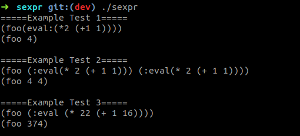

# sexpr

An s-expression parser for evaluating "macro" expressions, designed
to interpret and execute structured parenthetical expressions similar
to those used in Lisp-like programming languages.



## Compile & Run

```sh
gcc main.c sexpr.c -o sexpr
./sexpr
=====Example Test 1=====
(foo(eval:(*2 (+1 1))))
(foo 4)

=====Example Test 2=====
(foo (:eval(* 2 (+ 1 1))) (:eval(* 2 (+ 1 1))))
(foo 4 4)

=====Example Test 3=====
(foo (:eval (* 22 (+ 1 16))))
(foo 374)

=====User Test=====

```

## Performance

sexpr's recursive linked-list implementation exhibits O(N) complexity.

sexpr uses two linked-lists to complete its task. One for building the raw
expression and one for storing the final evaluated expression. A future
enhancement would use one linked-list to perform both functions in place, a
memory pool, or a custom allocator for tokens.
